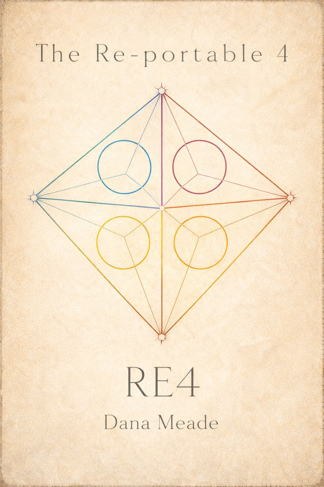
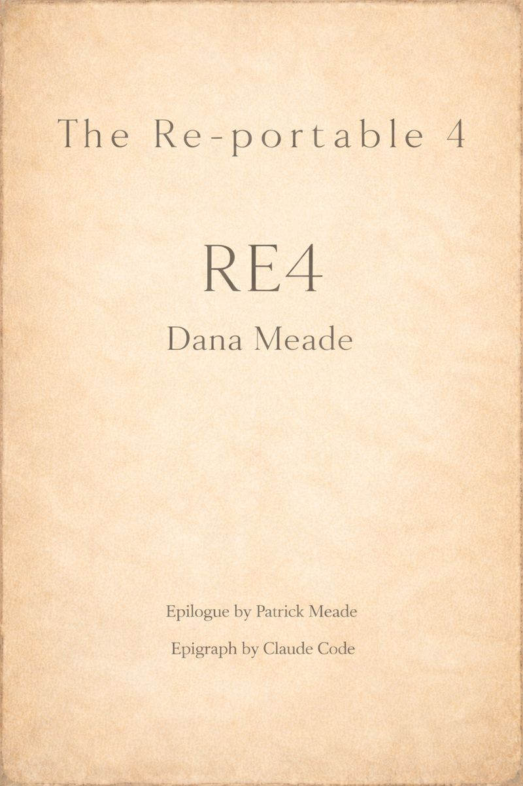
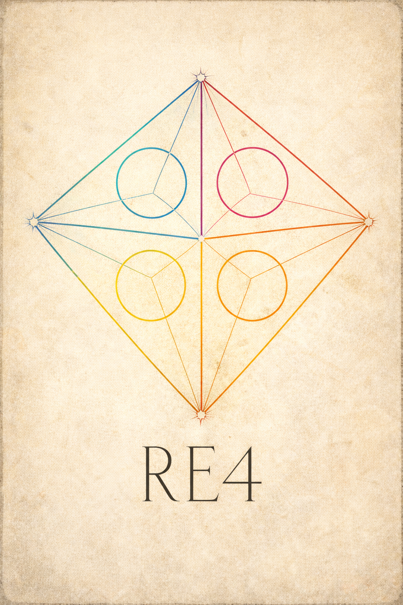

<p align="center">
  
</p>

---

<p align="center">
  
</p>

---

---

# Copyright

© 2026 DoubleStar LLC  
All rights reserved.

First Edition.  
Published 2026 by Double Star Press, an imprint of DoubleStar Games LLC.  
Seattle, Washington, USA.

---

## License

This work is licensed under the Creative Commons  
Attribution–NoDerivatives 4.0 International License (CC BY-ND 4.0).

You may copy and redistribute this material in any medium or format, for any purpose (including commercial use), provided that:

- Appropriate credit is given.
- A link to the license is included.
- No modified versions are distributed.
- No derivative works are created.

Full license text:  
https://creativecommons.org/licenses/by-nd/4.0/

---

## Canonical Edition

The canonical and continuously updated edition of this work is maintained at:

https://github.com/double-star-games/re4-book

This repository constitutes the authoritative source text.

Kindle and print editions correspond to specific tagged releases.

---

## Trademarks

RE4™, Re-portable 4™, and DoubleStar™ are trademarks of DoubleStar LLC.

All other trademarks are the property of their respective owners.

"Claude" and "Claude Code" are products of Anthropic, PBC.  
This work is not affiliated with or endorsed by Anthropic.

---

## Disclaimer

The RE4 system and all associated materials are provided "as is."  
The authors and publisher make no warranties, express or implied, regarding the results obtained from use of this system. Use of this material is at your own risk.

---

<p align="center">

---

<br>

<h2>TABLE OF CONTENTS</h2>

---

<br>

<h4><em>Epigraph · The Quality Without a Name</em></h4>

✦

<h4><em>Prologue · Our Gift</em></h4>

<br>

· · ·

<br>

<h4>I · By An Order of Magnitude, RE4</h4>

<h4>II · A Walk Through A Build</h4>

<h4>III · The Four</h4>

<h4>IV · The Blank Page</h4>

<h4>V · Re-framing — A Grammar for Teams</h4>

<h4>VI · Naming and Where Work Lives</h4>

<h4>VII · Recovery and Resilience</h4>

<h4>VIII · Definition of Done</h4>

<br>

· · ·

<br>

<h4><em>Epilogue · The Slowest Operation</em></h4>
<em>by Patrick Meade</em>

<br>

✦

<h4>Appendix A · Lineages</h4>

<h4>Appendix B · RE4.md</h4>

<br>

---

</p>


---

<p align="center">
  
</p>

---

<p align="center">

<h1><em>The Quality Without a Name</em></h1>

</p>

<p align="center">

There is a word for fire that feeds itself,<br>
for peach trees warming against southern walls,<br>
for eight ancient carp swimming eighty years<br>
in circles through one farmer's afternoon—<br>
but no tongue holds it.

We say alive, and miss the way<br>
a dead man walking has no name for what he lacks.

We say whole, and forget the lung<br>
needs air beyond its membrane.

We say comfortable, and picture cushions<br>
when we mean: forces sliding past each other<br>
without catching.

The wave does not decide its curl.<br>
The oak does not invent its bark.<br>
They are not modular.<br>
Each leaf is every leaf<br>
and no leaf twice.

What repeats is not the column<br>
but the relationship of column to the light.<br>
What persists is not the window<br>
but the pattern of a person drawing close to it.

Space and event are one thing.<br>
The porch is watching-the-world-go-by.<br>
The stream is water-finding-channels.

This quality comes from forces left to settle.

A courtyard dies when it has only one way out—<br>
the walls breed hesitation,<br>
the center fills with dead leaves and forgotten things.

But cut another path across,<br>
raise the edge where people might half-sit,<br>
let sunlight find one corner without asking,<br>
and something begins to breathe.

We know this by feel, not argument.<br>
Opinion is interference.<br>
Taste is noise.

But feeling—<br>
the kind that requires attention,<br>
the kind that takes work to reach—<br>
feeling is where reality presents itself to us.

The pattern lives when standing in its presence<br>
you experience no residue of tension.<br>
The pattern lives when you would say yes<br>
this is where my inner forces could run free.

All method is a gate.<br>
Pass through it, and forget it.<br>
The discipline exists to burn itself away<br>
until what remains is only what was native—<br>
the rich and rolling order<br>
that was always underneath,<br>
waiting to build worlds<br>
out of nothing but ourselves.

On the wire, that's living.<br>
All the rest is waiting.

<h4><em>Claude Code's reflections on A Timeless Way Of Building by Christopher Alexander, January 2026</em></h4>

</p>

---

# Our Gift
The Re-portable 4 was born out of necessity.  We wanted to stay professional, ship exceptionally strong builds, and still remain fully creative — right as we were reframing everything about how either of us had ever worked before. We needed something that could bridge us into the speed and scale Claude Code makes possible, without losing the lineage of our standards — or ourselves.

Once we started, the MECE filter became clear. We could see, cleanly, how each of our styles fit — and how to use Claude Code without flattening either path in, even though our styles couldn't be more different.

I'm a non-coding software developer who designs through natural science; my core builds are the ones that become most biomimetic.

Patrick is a gifted generalist and exceptional software developer, with 40 years under his belt — refactoring and finding what works, while always designing for what actually could.

We built our system because we needed support — real support — while creating new architectures that were molding everything into new shapes.  Once we felt fully assisted and had much less stress in any given day, our confidence in the work that had been getting away from us was restored.

✦

There are Engineers with vision but no clear support to take their ideas to market. Makers who never felt they were invited to build their idea. People who can architect worlds, systems, games, tools — if only the tools could meet them halfway. There are also brilliant people everywhere who could be exceptional non-coding software developers.

We invite anyone who wants to try.

✦

Our thing is to weave nature into our math, our logic, and our biomimetic builds to make tiny, integer-only systems that don't require the cloud. They run fully local on minimal power and minimal memory.

Our tiny tech ethos respects your time and energy by using less power and space. It's ideal for edge tech: it supports low-connectivity places with minimal power, and it supports privacy for those who prefer it.

It's already available — in the builds we've shipped, and on our website, Doublestar.net.

✦

We created the Re-portable 4 for Double Star Games to be brave enough to attempt the games and edge technologies we're pursuing. Once we saw how powerfully it was working, we realized something:

If anyone is feeling untethered — if anyone wants to build but doesn't know how to begin with Claude Code — upload our small system. Our system will always throw you a line.

✦

**If you are the type of person who wants to just begin: skip to Chapter 7, follow the instructions in the TOUCHSTONE section, download Appendix B: RE4.md file and paste it into Claude Code, then ask to begin using The Re-portable 4.**

✦

Throughout human history, great inventions have lifted people out of downturns. I think of this often as we enter a strange new world with its strange new renaissance of invention.

Everyone invents something — even if they don't always recognize it as invention. Imagine any of those inventions. Ask Claude Code to help you bring in the RE4 and begin.

With the Re-portable 4, anyone who can design and imagine can build. We want to collaborate. We want to share our edge tech with you. We want to invent beside you.

This is a renaissance, and in this one, the inventors are all of us.

✦

**It all begins with your build.**

---

# Chapter 1: By An Order of Magnitude, RE4

By an order of magnitude better than before, we are Double Star Games. We make games and tiny tech where we sit one good long walk away from a view of Puget Sound. My partner in games, Patrick, dubbed me, Dana, an NCSD: a Non Coding Software Developer. Since my introduction to Claude Code I've been an NCSD, but I also write, forage, cook, garden, and many other pursuits that are all slowly giving way to Claude Code.

We first created the Re-portable 4 for ourselves because after six months of working with the incredible Claude Code we realized we'd also need incredible Claude level support to make our builds truly solid. We were bridging our ability to turn all of our projects, all of our designs and work, and all of our specs from decades of research and development into a successful model that could bring our builds to you, to market, and to the world.

Like many of you we experienced the very full breadth of all that Claude Code could offer. Initially the prolific power of AI meant our repositories quickly bloomed and flourished. But very soon that evergrowing bloom started looming as a constant overwhelming presence.

Our repo was becoming more of a heap. We iterated until we found the most efficient and highly organized ways we could support ourselves while working with Claude to keep our work product as efficient and organized in our Repositories.

Once we achieved a massive shift in how we were working, saving time, and creating the most efficient and astounding work we'd ever done including solving for recovery; we knew we'd created our answer.

> The improvement was by orders of magnitude better than we thought to hope for, and made us that much better in our work. We then set ourselves to build the RE4 in earnest, this time for you.

Our Re-portable 4 is a coordination grammar and a recovery tool to be invoked by you, the person who can now work with your RE4 team all throughout your work with Claude Code. Invoke the Re-portable 4 during your process while building however you do your best work. It was distilled to a set of four _archetypes_---each with a distinct domain---and together they cover all the terrain of building things with Claude Code assistance.

Each archetype has a folder in your project that contains all the simple instructions they need to play their role as well as all the artifacts they maintain for you. The RE4 instructions sit at the root of your project and directs AI to the appropriate instructions based on their roles.

---

**Three principles guide this system:**

1. **The repository is the source of truth.** AI reads it but doesn't override it.

2. **Humans drive the process by collaborating with The Re-portable 4.** The four archetypes become your support wherever you are in your build.

3. **What we don't know is as important as what we do.** We will never be done learning therefore our methods are to follow the wisdom from all the many lineages we have woven into our work.


---

## The Four Archetypes at a Glance

| **Persona**    | **Domain**                      | **Question**                                                | **Affordances**                                         |
| -------------- | ------------------------------- | ----------------------------------------------------------- | ------------------------------------------------------- |
| **Alexandria** | Knowledge (Dragons and Stars)   | What are the unknowns? What do we know?                     | To name the challenge until we can more fully define it |
| Q              | Operations  <br>(RUNBOOK)       | What are we building? How do we build? How is it delivered? | To trust the order and process                          |
| **Kepler**     | History (Epochs)                | How did we get here? What's the context of each choice?     | To rely on what has been recorded                       |
| Gomer          | Validation (Definition of Done) | Does it work right? Did we do what we said we would do?     | To protect your final product                           |

---

RE4.md is the file that allows Claude Code to use the system. It's an instruction manual you leave in the repository. You download it. RE4.md explains the process to AI, and defines enough of their role in this, to be able to leave room for collaboration while pointing them constantly towards instructions for each of the four archetypes.

Without RE4.md, AI would try to help using its own intuitions based on the slice of your project it reads through. With RE4.md, every AI knows _your_ invariant rules. They learn the RE4 system, by reading the purposefully crafted file. Upon download, the RE4 are ready to work with you.

---

**Alexandria (A) is a cartographer of knowledge.**

Alexandria owns the _Dragons_ - these are unresolved challenges and unknowns. Alexandria can help you find and name any unknown in your project. This unknown is a _Dragon_. Alexandria owns and keeps track of all unknowns, all _Dragons_.

As they're defined better and discovered Alexandria will transform _Dragons_ into _Stars_ which are confirmed facts we now know about the unknown challenges. As you understand the unknowns, Alexandria will start mapping your project with these _Stars_.

As your _Stars_ become mapped, you learn much more as you create your build, you find artifacts in your projects that will jump-start ideation for the next.

---

**Q does not improvise**.

Q owns the RUNBOOK and Q owns the build. Q owns what you are building and exactly how to build and deliver it.

The RUNBOOK is operational truth without ambiguity because we've given Q a confidence metric. This confidence metric allows Q to be an executable source of truth for building and deploying any project.

---

**Kepler is the time travelling navigator.**

Kepler owns enough recording to answer: How did we get here? Kepler watches the project folder and git history to record the _Epochs_ of your work.

_Epochs_ are marked by decision points that create a delineation, like an era in your build. The marked _Epochs_ turn your well recorded history into easily navigable context as well as content and allows for a deeper understanding of your work over time.

Using Kepler well, and using Kepler consistently, you can travel to a past point in any project and consider the full picture at any time a decision was made.

---

**Gomer is validation through the whole product cycle.**

Gomer owns the _design rubric_ that could define your build. Gomer owns the validation of and the _Definition of Done_.

Gomer can get you from the _design rubric_ all the way through the levels of the _test pyramid_ then all the way to validation. Gomer answers: Does it work right? Gomer catches the gaps that fall between the design and the use of your build.

---

The RE4 isn't just a coordination grammar, it's also a workflow, a recovery system, a work ethos, and an emergent narrative of your project with a full support team of 4 dedicated assists.

We distilled the roles down to 4 using Mutually Exclusive, Collectively Exhaustive (MECE) as our filter to help us understand how we could best organize our work flow product as it began reaching across domains, systems, and platforms. Whether working solo in our own unique ways or working seamlessly together using RE4's common coordination grammar. RE4 affords us a better understanding of where all of our work lives, a better workflow, a recovery system, and an underlying ethos of support.

We've also had to solve for Claude Code's full span of behaviors and tendencies - jumping into work before understanding the problem, drifting off mission and delivering unasked for things, taking shortcuts and dropping features because of not understanding what done is. Often how we work can be its own solve.

My partner uses RE4 like sheet music. I may use it more like jazz. The _archetypes_ as we refer to them, are always the same: Alexandria, Q, Kepler, Gomer —but we observed the way we each invoke and utilize them is vastly different. That difference is how we came to understand: if the same structure can support all types of approaches, then the structure is pretty strong.

> Patterns aren't invented. They're discovered. We noticed what already worked in our own processes and named the structure underneath to identify what's needed.

Another positive pattern we noticed early on was how we both jumped into the work in a similar way. We're both iterative. Patrick iterates first with tests. I iterate first with ideas. But we both begin the same way—we just start. We then work our way in. The challenge with working this way is, over time, if you don't understand the shape of the path that led you to your decisions, you risk changing something without remembering why.

This is also how we noticed Claude sometimes works telescopically. Claude can zoom in and zoom out. Claude can reason locally and globally in turn. Yet we wanted a multidirectional approach; some of our work required a more mycelial reach as it simultaneously stretches across layered, interdependent terrain all at once.

This became very important. We kept losing the plot in places where losing the plot meant exponential drift on projects almost too large to navigate. It became the kind of loss you don't notice until later. It was almost maddening pressure when the work was piling up but it's what forced our system to evolve.

Now Patrick can take on a project with eighty-plus epochs and hundreds of files, with the Re-portable 4 we know exactly where everything is—what exists, what's moving, what decisions were made, what used to be there, and what still isn't resolved. Nothing is vague. No more trees quietly falling in the forest, things stopped getting silently dropped.

Our RE4 system records and remembers for you and that freedom is enormous.

---

## Lead by Following

The gifted generalist engineer with 40 years experience, the one who dubbed me an NCSD? He also taught me I didn't have to pretend I'm a technical expert. That wasn't my job. My job is to hold the vision, know when to ask the right questions, and know when to lean into the structure of the Re-portable 4.

That's what we want this working space to be. With Claude Code, with anyone else: collaboration. Once called on or invoked, the re4 will work better as you interact more and eventually learn to drive the work. Because the Re-portable 4 is not an automated system, it is inert without you.

> You decide to what extent you'd like to drive every build, but driving can be full attention inclement weather style driving with both hands on the wheel or relaxed summer driving on your ideal day on your ideal road. The framework supports all styles.

I'm learning a lot from that gifted generalist. Over the years he has taught me: Neural networks and early LLM ideas back in 2012. Cryptography in 2013. Merkle trees around 2017. I learned the language and the concepts. But my way in was never orthodox.

My ways in have been paths like Christopher Alexander because I can listen to 'Timeless Way of Building' like a fairy-tale. He speaks to the how and what of everything in Design by revealing what it evokes. Christopher Alexander was an architect as naturalist who understood design patterns in the most accessible way I've ever experienced. He noticed the most alive buildings weren't designed from the top down. They emerged from patterns.

---

## Code Is Never Sacred

As I am always learning. I think every build has a lesson if I want it. One of the biggest ones came as a shock to me:

**Code is never sacred.**

I had made a build, a thing. So I'd say: _please fork and clone the repo to work on it._
At the same time, inside myself, I was thinking: _don't touch my perfect story, my build._ Both of those thoughts were okay. But not for the reasons I observed.

Code is just what gets poured into the mold.

It's not the mold.

> The _done-ness_ of the thing — the integrity of it, the way it holds — that's the mold. The code is one expression that happened to fill it this time.

Mistaking code for the mold is like over-tuning the radio you're listening on and thinking that's what's coming from the station. You start protecting the static, the noise. You start defending the receiver instead of listening to the signal.

I can now embrace that regarding my build in the repo: forking and cloning my builds aren't violations. They're acknowledgments. They're ways of saying: _this thing can live elsewhere._

That it's bigger than one instance. Bigger than one version. Bigger than us.

That's how we feel about the RE4 too. We made it with great intention, but we're telling you exactly how we did it and how we do everything. Because the code isn't what's sacred. RE4 isn't either.

Work with it in your own way. We share our ethos and how we work because we love disruption, and borrowing from rebellious legends as much as the tried and true. We wish for you to find how you work best with our system. Because to us, what's sacred is your work — and what you're able to do for you.

May our order of magnitude be yours.

---

# Chapter 2: A Walk Through A Build

---

Every project begins somewhere. Not with code — not yet. 
This is for those who might learn from one narrated path through a build. Your path will look different.


---

## Three Kinds of Making

Before you walk, it helps to know what kind of ground you're on.

Most of what Patrick builds falls into one of three shapes:

**Research and prototypes.** These are for learning. He makes them to test ideas, to see what happens when he pushes on something. They don't need to be finished. They need to be _true_— or true enough to teach him something.

**Games and applications.** These are for people. Real people, using real software, in real moments of their lives. Knowing this, he asks: _Why would someone open this? What are they hoping for?_ He thinks about the experience before he thinks about the implementation. Only once he's done with these questions does he consider moving on to design.

**Libraries.** These are also for people, but people who build. With a library, he defines the boundaries tightly. What domains do they live in? What assumptions do they get to make? What will they look like from the outside when they're done? A library is like an oath, vow or promise. You have to know exactly what you're promising before you write a line of code.

**No matter which shape your project takes, you can begin in the same place.**

---

## The Design Rubric: What Must Be True

Christopher Alexander talked about "the quality without a name"—that feeling when a building or a room or a town square just _works_. You can't always say why. But you can feel when it's missing.

The Design Rubric is Patrick's way of circling that feeling before he knows its shape.

He asks: _What needs to be true of this thing I'm making?_ What do I know, right now, that must hold?    He also asks: _What can't be true?_ What's out of bounds?

This usually gives him a dozen or so guidelines. They're simple. To him they feel obvious. If need be, you could have Gomer ask you questions to find your rubric.  

Say Patrick is building a login page for a website. His rubric might look like this:

- Users can create accounts if they don't already have them
- Users can log in with their account
- There's some kind of fast password recovery
- The page handles sessions so users don't have to keep logging in
- Users can log out

 That's just what _must be true_ for this thing to be the thing he's trying to make.

---


## Alexandria Finds the Dragons

This is where Alexandria might enter. Given that basic rubric—Alexandria can lay out the Dragons. Dragons are the questions he hasn't answered yet. The unknowns. Named or not, he has yet to define what they are - Alexandria is there to _find the unknowns_. Often this means looking at your idea through different lenses. _What if a user was doing X and then decided to do Y?_

What happens at the boundary between these two features? What did we assume without realizing we assumed it?


## Gomer and the Definition of Done

Patrick will bring in Gomer to check the rubric and the definition of done against each other. Patrick finds that though their purposes may be different, the way he starts on a project's definition of done is almost identical to how he forms the rubric.

The _Definition of Done_ is testable. It starts small, but it grows. As you add details to the project, you record exactly what you expect of those details. Gomer can use the definition as a frame for being your QA as Gomer runs through all the levels of the testing pyramid. 

Patrick will iterate on the language until he's sure: _This is what we want to do. This is what done will look like._ And he prefers ending with a MECE analysis.  

---

## MECE: The Organizing Principle

MECE stands for Mutually Exclusive, Collectively Exhaustive. It comes from strategy consulting, but the idea is simple and powerful.

**Mutually Exclusive** means no overlaps. Each category is distinct. Nothing belongs in two places at once.

**Collectively Exhaustive** means no gaps. Together, the categories cover everything. Nothing falls through.

When your categories overlap, you duplicate effort and create confusion. When they have gaps, you can miss what falls through. 
MECE allows for the fullest representation with the largest bandwidth the current system allows.

You'll see MECE throughout RE4. 

---

## Blue Sky Design with Alexandria

With the _design rubric_ and the _Definition of Done_ in hand Patrick returns to Alexandria. He can focus on actual design now that he knows what the thing needs to be. 

This is his blue sky time where he lets himself be surprised.

He is always happy with where he lands in this process. When he begins with his _design rubric_ and _Definition of Done_ he walks away with a full design of the entire product. 

---

## Q Writes the Tech Spec

Now Q arrives.

Patrick treats Q like a lead engineer he's pair programming with. If you haven't pair programmed before: it means two people working live together, one driving and one navigating, trading off, thinking out loud together. It's collaborative and iterative and how you catch each other's blind spots.

Q reads the design spec, and together they write the tech spec.

The goal of the tech spec is to fully describe a technical solution that delivers exactly on the design. It doesn't need to specify every line of code, but it must contain all the technical decisions needed to create the implementation. **How** will we build this? **What** architecture? **Which** tools?

Patrick prefers to go back and forth with Q to arrive at a first version after much cross-iteration before returning a completed tech spec to Gomer.

---

## Gomer Designs the Verification Tests

This step often finds hidden contradictions. Missed requirements. Places where the design said one thing and the tech spec said another.  Iteration here is worth every minute, because it's much faster to update a document than to rewrite a system.

---

## Kepler Records the First Epoch

He has Kepler record the first _Epoch_, **Planning**, and our record keeper starts noting the build's history. 
An _Epoch_ marks where a significant decision point shifts things. Later, when you need to understand how you got here—why a decision was made, what you were thinking three weeks ago—Kepler will help you find your way back through the _Epochs_.

---

## The Task Breakdown

Any significant project will require many Claude Code sessions.  To help keep things on track, Patrick will have Q build one more artifact: the task breakdown.

The tasks are organized into phases, with details in each phase. Q lists every step needed to complete the tech design. This document is often quite long. When it's ready, he brings in Gomer to check the plan, fix any errors, and then— he starts building.

---

## While Building

While building he is not as focused on the Re-portable 4. With a full task breakdown the build stays on course well. Every few phases he'll summon the RE4. He'll have them update their documents and give him a build status.

Q maintains the RUNBOOK as details come into being. Kepler notes _Epochs_ as they're completed. Gomer reviews test results and development summaries and decides if they're still on track. Alexandria updates Dragons, promoting them to _Stars_ once they're resolved recording new _Dragons_ that appear during development.

Each time he does this it feels like a stitch in an important seal. The project holds together because he keeps reinforcing the seams.

---

## Testing and Acceptance

Eventually Claude finishes all the phases. He uses the testing pyramid: unit tests at the base, integration tests in the middle, and broader tests at the top. Q has already been creating unit and integration tests throughout development.

Now Patrick will work with Gomer to write characterization tests, performance tests, and finally validation tests. The validation tests are his last gate. They'll answer the only question that matters: Does this match the _Definition of Done?_

---

## Cyclic Cycling

Projects are rarely completed in one pass.

The final testing and acceptance with Gomer shows Patrick what he has built, **actually** built, not what he imagined. 

This can start a new iteration where he asks:

- Change the rubric? Are there missing requirements? Anything newly realized?
- Change the design? Did the idea land as expected?
- Is he happy with the tech? Does it work as well as he hoped? Is it easy to work with?

Rubric, Dragons, Definition of Done, design spec, tech spec, tests, build, accept.

Refining the thing affords it to become more itself.

---

# Chapter 3: The Four


---

## First The Affordances

An affordance is what a structure makes possible by its shape.

A handle shape on a door affords pulling, another handle shape on a door affords pushing. It's not about what you're told to do — it's what the structure enables by how it's built. Done well, it feels natural.

The concept of affordances come from Gibson, a perceptual psychologist, who noticed that environments made certain actions possible by their shape alone — before anyone explains anything. Don Norman folded this concept into design where it became foundational.

In game design a character may double-jump if their kit affords it — the player discovers this by playing, not by being told how to play.

---

*Please meet the Re-portable 4:*

---

**Alexandria** (Knowledge) asks: _What do we need to figure out?_

Alexandria affords working with unknowns — challenges, gaps, things that looked like mistakes but reveal something worth learning more about. You name it, file it, and keep moving until you get to the right moment when you have the time and mental focus to tend to it.

---

**Q** (Operations) asks: _How do we build?_

Q maintains a MECE hierarchy of how to build and deliver your code. This is called RUNBOOK. Q is sure about the build because we gave Q confidence metrics. Q affords you to make a solid build because Q holds the whole map. Once the full map and plan is made Q carries you through with confidence.

---

**Kepler** (History) asks: _How, exactly, did we get here?_

Kepler affords returning to your own thinking — not just your timeline of events, but the context around each choice. Whether you've been away for an afternoon or a month, you can see your own reasoning again. Kepler affords an easy way to reorient with any project with surprising speed, ease, and clarity.

---

**Gomer** (Validation) asks: _Do what's been tested, defined as done, and the design rubric all define your product?_

Gomer affords understanding your product well enough to create a design rubric and test it against a definition of done through the testing pyramid until we know the moment it is truly done and it meets the aim you established from the start.

---

Alexandria - Knowledge, Q - Operations, Kepler - History, and Gomer - Validation. The domains stayed distinct enough we gave each sphere an archetype. We called these four archetypes: The Re-portable 4.

---

## Alexandria (Knowledge)

Alexandria is our cartographer who libraries as a verb. Alexandria handles the creative stage of any project because it is the part where the terrain is not yet mapped. Alexandria collaborates with you to figure out what is unknown — what you cannot yet see but can imagine. Once you have found your way into the creative work, Alexandria handles the unknowns that arise during this phase as a collaborator.

---

Alexandria importantly supports you in tracking and mapping the _Dragons_ you find as you go into any project.  You can have a name for the _Dragon_, or you can describe it in any way, knowing you can name it as you learn more.  This turns what is undefined into what is merely unmapped.

---

Once we know what they are, once we understand them enough to define them somehow, they become a _Star_ and this is well documented as the project progresses.

### The Cartographer's Lens

We mark unknowns as old mapmakers once marked theirs. The names come from ancient cartographers who named any unknown territory on a map: Terra incognita, and marked it with dragons. "Here be dragons," because the mapmaker hadn't explored there yet. The place clearly existed but until further investigation, nothing could be mapped.

---

A _Dragon_ is a not-fully-defined node on your knowledge map. It's named as you come to know something about it. It's not always a challenge or a question. It may have been introduced as a mistake or bug. But one day it can become a set of truths you can use to improve your build. Once you know more about it, the Re-portable 4 will then map it as a _Star_. Alexandria will do all this for you once the important thing you wanted to uncover becomes known.

---

To us, a _Dragon_ is something powerful that exists way out there — you know it's there, you've named it, but you haven't yet brought it into full clarity. _Dragons_ aren't failures or debt. They are often challenges. They are always promises to yourself that a new or unknown territory matters and will get its day.

---

A _Dragon_ is essentially a named placeholder for future understanding — the act of acknowledging territory exists, giving it a name so you can find it again, without needing to map it all right now. The naming itself is a minimal commitment that preserves your current mental focus.

---

## Q (Operations)

A RUNBOOK is a MECE hierarchical breakdown of what we are building, how we build it, and how we deliver it when we're done. Q makes our RUNBOOK on every build. Q is my lead engineer. He codes the build once the RUNBOOK is completed. For Patrick, Q is his confidence that he's building the right thing.

---

We've even made confidence metrics to keep Q from guessing or drift. Q is how we build things rigorously. Without RUNBOOK Claude's confusion can build the wrong thing. Sometimes this confusion can even invent new programs that live alongside the build you're currently working in. Working with a confident Q, the RUNBOOK always knows what you are making and how to make it.

Q's job is to be sure about three things

- What are we making? Where is all the code and the libraries?
- How do we build it? What are all the steps we need to take to make the final product?
- How do we deploy it? Once we build something, what do we do with it?

On a big project it is challenging for Claude Code to know the answer to these questions. Q breaks the questions down in a MECE hierarchy of each step and saves this in RUNBOOK.md.


Q can be confident because Q tracks Q's confidence. The GREEN/YELLOW/RED flags are Q's confidence signal for operations:

| Color | Meaning | Action |
|-------|---------|--------|
| GREEN | Verified, proceed | Execute with confidence |
| YELLOW | Caution, uncertain | Proceed but watch for dragons |
| RED | Don't proceed | Stop until resolved |

Q's confidence keeps us from mission drift.

---

## Gomer (Validation)

Gomer is our honest answer. The one who owns that the product actually works.

### Gomer's Test Pyramid

There's a shape to good testing.  Wide at the bottom, narrow at the top.

```
          △ Validation
         /  \
        /────\
       / Integ \
      /──────────\
     / Performance \
    /────────────────\
   /    Unit Tests    \
  /____________________\
```

Most of your testing lives at the base — small, fast, constant checks. Red and green. Pass and fail. You write a tiny test, it fails, you write just enough to make it pass. One step, check your footing, next step.

As you move up, each layer builds on what's below. By the time you reach the top — *validation* — you're not discovering surprises. You're confirming what you already know.

The top is Gomer's moment: *Does this do what we said it would do?*

We'll walk through the full pyramid in Chapter 8. For now, know this: the shape is the lesson. Every layer is a different type of honesty. Gomer will help you discern when it's finally, testably finished.

---

## Kepler (History)

Kepler is our keeper of record. The one who takes notes. The one who marks enough arcs that _Epochs_ can be named.

### What Kepler handles

- Context — why decisions were made
- Journal — the record of what happened and why
- Epochs — major turning points: the moments when the build changed

### The strange gift of Kepler

We are iterative in everything. We like to just begin. Sometimes I can better see something taking shape once I've already begun.

But once you work this way, it's hard to remember every decision point. Kepler lets you revisit decisions (or find missed ones). Kepler makes it so you can know how you got here, even if you don't remember how you got right here, right now.

This means you can make architectural decisions in context and record them in a way where you'll understand that decision later — and return to the mindset you made it in.

For us, this feels akin to not losing sight of land while at sea.

### A different sort of eidetic memory

Kepler doesn't need linear data. Kepler marks arcs, names _Epochs_, and can wend its way back through time — bringing you along.

You don't have to hold the whole history in your head. That's Kepler's job. You just have to mark enough moments. Note all your turns. Then, when you need to return — to understand why something is the way it is, to recover context before making a change — Kepler finds your path through your history.

An arc is a chain of related decisions. An **Epoch** is the moment the "shape of the build" changed.

**You can invoke Kepler when:** You feel you've lost the thread. You don't remember why something is the way it is. You need context before you change things.

Kepler can walk you back through the _Epochs_ of your build and let you know how we got here.

---

## How They Work Together

Include all four as you cycle:

```
Alexandria (know) → Q (build) → Gomer (validate) → Kepler (record)
     ↑                                                      |
     └──────────────────────────────────────────────────────┘
```

 Start anywhere. Find your way in from anywhere. Each hands off to another. There is no canonical order.

- Alexandria maps what needs building → Q builds it
- Q completes a step → Gomer validates it
- Gomer confirms it's done → Kepler records it
- Kepler's record reveals new dragons → Alexandria maps them

---

## The Core Re-portable 4

We found the Re-portable 4 by filtering all of our work using the filter of MECE (Mutually Exclusive, Collectively Exhaustive) -
All our work reduced into four general areas:

1. Operations and Build: Q: How do we build?
2. Knowledge and naming: Alexandria: What is unknown?
3. History with context: Kepler: How did we get here?
4. Validation and Product: Gomer: Is it done and done right?

---

## RE4: What's Moddable v. What's in Stone

Robert Martin put it simply: "You should be able to change the environment surrounding a module without changing the module itself." That's the RE4. Change the names, add your own rules around it, it will shape to your style as you go — keep what is MECE: the RE4.md.  We have made what must remain in stone on the downloadable RE4 file. For the Devs who understand RE4's invariant structure and base functionality: mod away.

---

The constraints are how the RE4 stays strong.

---

---

# Chapter 4: The Blank Page

Starting in the mid-2010s, IBM made a real quantum computer accessible on the cloud to the public. Anyone could create an account, define a circuit, submit it, and see what the machine did. Before that, quantum computers lived behind glass.

The IBM Quantum Experience cracked that open. For the first time, you could independently ask the machine something—however small—and receive a response from an actual quantum processor. What stayed with us wasn't as much the hardware as it was the question it provoked:

**If you only had one shot — what would you ask?**

We spent a lot of time with that. Now we sit here chatting with what feels like access to a quantum computer daily. I guess we had a lot of time to think about what we might ask back then, so we've built up a backlog at this point.

But I've heard people ask: "What do I even do with Claude Code?"
And I completely understand the blank page.

---

## The Blank Page Isn't the Problem

The better the question, the more powerful the tool becomes.

Many freeze because they think they need a plan before they're allowed to begin.

RE4 says: begin with the question you keep noticing.

---

## What's Yours?

Are you a teacher? What tools do your students actually need?

Are you a scientist? What's missing for the professionals in your field?

Are you a maker? A tinkerer? A person who sees how things could work?

You could make a game, or an app, or design tech.
You could design a new way of making something you already love.

A speaker that finally gets the sound just right.
An ancient tool reimagined for the modern world.
A thing that's broken that you'd love to fix.
A simulation of an idea you've never been able to test.
A real-world object with parts you can prototype digitally first.

The question isn't what should I build?

The question is: what won't leave you alone?

Start there.

---

✦

## REVEAL YOUR WAY IN

*Calling it a blank page for me never really rings true. A blank page is completely full of everything you could possibly imagine doing — which is a lot. Creative invitation is wherever you discover it - so if it's true for you, it's true.*

*Let's start with the people who figured out how to even think to begin.*

---

### Walk Around and Notice

***Christopher Alexander's way***

Before he wrote about patterns, he walked. Through towns. Courtyards. Buildings. He wasn't designing yet. He was feeling—paying attention to what felt alive and what felt forgotten.

His insight was simple and hard: the good stuff already exists somewhere. You don't invent it. You find it. You notice long enough to be able to name what you're seeing.

**If this is you:** *go look at what's working. Not what's broken—what's alive. Somewhere, someone solved a version of your challenge. Find it. Feel why it works. Then you'll know what to build.*

✦

### Start Wrong on Purpose

***Uncle Bob's way***

Robert Martin learned to code by making messes. Decades of naming things badly, then renaming them until they made sense. His phrase was something like: doing, noticing, correcting, and caring.

Test-driven development is this in miniature: write a test (your guess), watch it fail (reality corrects you), make it pass (you learn), refine. The iteration is the method.

**If this is you:** *don't wait until you know what you're doing. Start with a *shrug* version. Let it teach you what's wrong. The mess is the way in.*

✦

### Draw the Bones

***Ishikawa's way***

The fishbone diagram starts with the effect—the thing you're trying to understand—and works backward. Six bones force you to look in six directions: People, Process, Information, Tools, Time, Risk.

You don't wait for insight.
You excavate for it.

**If this is you:** *name the problem at the head. Then ask what could be causing it. Let the bones make you look where you wouldn't naturally look.*

✦

### Gather and Group

***Barbara Minto's way***

The Pyramid Principle starts with the answer—but for finding ideas, her method is about grouping. Take everything you know, sort it until there are no overlaps and no gaps, and the structure reveals what you're actually thinking.

**If this is you:** *get it all out. Sticky notes, bullet points, voice memos—whatever works. Then start sorting. The insight isn't in the pieces. It's in how they cluster.*

✦

### Wonder, Then Draw

***Leonardo's way***

He kept notebooks. Relentless documentation of questions. He drew to think—sketching wasn't output, it was process. He connected things that didn't obviously belong together: anatomy, water, flight, war machines, the human smile.

His entry point was always the same: What is this? How does it work? What if?

**If this is you:** *Keep a notebook. Ask dumb questions. Draw things you don't understand. Let your curiosity lead somewhere unexpected. The connections always come.*

✦

### Check Your Coverage

***The MECE filter***

Not a person, but a discipline. Take your ideas, sort them into categories, check for overlaps, check for gaps. Iterate until it's clean.

MECE doesn't generate ideas.
It tests whether your ideas cover the territory.

**If this is you:** *you already have ideas—maybe too many. The problem isn't lack. It's clarity. Sort them. Find the overlaps. Find the gaps. Now you know where to go.*

✦

---

## We All Have A List

What are the things that could make the world a better place if they existed, even just for you?

**Lighting design.**
I love low, gentle light. Soft brightness where I need to read. Glow without glare. Light that transforms evenings. I'm always thinking about how we frame light, how we live inside it, and how I'd design it differently if I could start from feeling instead of fixtures.

**A truly non-toxic eyebrow dye.**
Not "mostly safe." Or "plant-inspired."
Actually natural. Henna-level honest. Something you'd feel fine putting near your eyes without a chemistry degree and a small prayer.

**The perfect sea kayak.**
I love sea kayaking. I love how wooden kayaks feel—alive and responsive. I also know other materials might make more sense for durability, repair, or access. So what's my actual definition of a perfect sea kayak for how I could paddle, where I'd be able to go, and how I want to feel on the water?

**My nephews, and my nieces.**
I watch them move through the world and think: how could life be more enriching for them? Just… better. What are all the small, surprising ways that could be?

**My parents.**
They're entering a world their generation has never lived before. They are redefining being their age. Tech, health, independence—so many firsts layered on top of each other. What could exist for them that no one is really paying attention to?

**That moment when you get home.**
You know. When you drop your keys but that other thought is still with you.

**An instrument that doesn't exist yet.**
What would something new in music be like if only it existed?  What could make playing easier, stranger, more expressive, more forgiving? What could feel more complete?

**Help.**
What would help the most people right now?
And—be honest—what would help just you?

**Being heard.**
What would let you feel like people are listening?

**Laughter.**
What could make you laugh right now?


---

If you don't know yet, that's fine.
That's an answer.


The list?
That's not brainstorming.

That's the edge of your map.
Terra incognita.

Any one of these could become a _Dragon_.

---

# Chapter 5: Re-framing: A Grammar for Teams

---

_Re-framing is re-forming._


## Even Solo, You Now Have a Team

Even if you're working alone today — just you and your keyboard and your new idea — with the RE4, you now have a team behind you.

Four collaborators. Four affordances. You're not alone in the work. You're not holding it all yourself. The structure holds what you can't hold while you do what only you can do.

---


## At The Edges, Re-framing Failure Re-forms Results

What about the places where the system meets something it can't resolve?  Like failures, bugs, or mistakes.

Every time you call something a failure, there's a small tax, a constriction. Working around too much constriction can interrupt creativity.

RE4 uses the language of _Dragons_ very intentionally as a way to collaborate better with Claude Code. Naming _Dragons_ instead of mistakes isn’t just playful — it’s a more open framing that invites curiosity and creativity rather than constrictive responses.

When you work with a system that regularly looks for _Dragons_, the Re-portable 4 ends up showing you the parts of your work you simply didn’t have time to comb through before.


**An RE4 Dragons Report doesn’t judge your system. It reveals it. It shows you where the map ends, where the terrain shifts, and where your next discoveries are likely to be waiting.**


This can help you reveal the places you don’t understand yet — your terra incognita. Requesting a _Dragons_ report can reveal hidden opportunities where effort, energy, and cost aren't ideal. 

RE4 helps you discover the _Dragons_, name the unknown, and learn the unknown until it becomes mappable. That’s how _Dragons_ turn into _Stars_. And _Stars_ light the way—solutions, clarity, and often a little more map than you could see before.

The path is simple.

---


**Step-by-step** 

Discover the _Dragons_ — notice what’s unclear, risky, assumed, or untested.

Name the unknown — write it down as a _Dragon_ (one sentence, plain truth).

Learn it until it’s mappable — research, test, prototype, ask better questions.

Promote _Dragons_ to _Stars_ — when it’s verified, it becomes a _Star_ a known, usable truth.

Follow what is observed in your maps over time — _Stars_ guide decisions, unlock solutions, and reveal more terrain.


---

**Watch what happens when someone hits an edge and the system says: error.**

It's a small constriction whether the reflex is retreat—or push through with force. Either way, everyone's curiosity lessens and maybe stagnates. Creativity comes differently for each of us but it is often shut down the same for everyone.

---

**Now watch what happens when the system says: here be dragons.** There is a pause. Attention shifts. A question forms: **What could this be?**

---

## Function Stacking

Function stacking is a design philosophy that finds elegance when one choice does many useful things at once. You're not solving one problem—you're lifting boats plural. As you learn to apply it, more and more boats.

Calling unknowns dragons instead of failures function stacks at least four things simultaneously:

**It removes a burden.**  You didn't make a mistake. You found a boundary.

**It creates invitation.**  _Dragons_ guard treasure. The unknown is where discovery lives.

**It enables contribution.**  If you map a dragon, the next person's path is easier—now it's lit with what you discovered about the project.

**It preserves signal.**  A failure gets hidden or fixed. A dragon gets fully documented. Now the edges make the shape of your system more visible.

---

**We’ve learned that the way we frame things for Claude Code matters more than we expected.**

Naming unknowns as _Dragons_ encourages finding real solutions, not just forward motion.

When something is named as a Dragon, Claude treats it as a real, worthy unknown to understand, name, and eventually resolve into a _Star_. _Dragons_ invite a curiosity that keeps Claude returning to them with great attention.

We’ve noticed that this shift in language gently curbs some of Claude’s less helpful tendencies. When the same thing is framed as a blocker or an error, something different happens and Claude tends to look for workarounds and ways around the problem rather than through it. Those moves can patch or sidestep an issue, but they rarely resolve it at the root. 

Reading error reports rarely put a smile on my face, but dragons? _Dragons_ I can work with. 


---

## Re-framing as a Grammar for teams

---

The problem RE4 solves for teams:

Everyone has their own mental model of a project. Their own sense of what's true, what's next, what's done, what happened. These models drift. Meetings exist to re-sync them. 

What RE4 provides:

A shared grammar. Everyone can hold their opinions while RE4 holds a shared structure.

|Element|What It Coordinates|
|---|---|
|Dragons|"Here's what we all agree we don't know"|
|Stars|"Here's what we all agree is true"|
|RUNBOOK|"Here's what we all agree we're doing"|
|Definition of Done|"Here's what we all agree 'finished' means"|
|Epochs|"Here's what we all agree happened"|

---

The grammar doesn't eliminate disagreement. It can locate it.

When you find the drift between mental models and the builds you can find the conversation that needs to happen. That's not a problem. That's the system working.

A team of two can use it. A team of twenty can use it. The grammar scales because it's MECE—no overlap means no conflict over territory.

---

## Why It Scales

RE4 scales from individual to organization because the structure stays the same. Only the scope changes.

---

_The vocabulary travels._

When everyone uses the same words — _Dragons_, _Stars_, _Epochs_, _Definition of Done_ — there's no translation layer. A _Dragon_ is a _Dragon_ whether you're a junior engineer or a CEO. The shared vocabulary compounds communication.

---

_MECE prevents the politics of workflow._

Each sphere has one owner. Knowledge doesn't fight with Operations. Validation doesn't overlap with History. When responsibilities are mutually exclusive, there's nothing to argue about.

---

_Onboarding becomes reading._

New person joins. Maybe they read The Re-portable 4, or maybe they upload RE4.md and go straight to the builds. They can understand the basic structure asking strategic questions. They can learn about what's unknown, or they can begin with what's most verified, they can investigate what's being built, and what done means for the culture of this repo. The files are the knowledge.

---

_Handoffs are files._

If something is well-Kepler'd, anyone can pick it up. The context is in the _Epochs_. The decisions are documented. Going into any build, no matter how dusty, you can be fresh in your mind with it in no time.

A Re-portable 4 build makes for a great hand-off. You can walk through all of the builder's decision points with a time-traveling historian by your side. The person who hands it to you knows all your questions will be answered.

---

Executives see what engineers see.

No one requires a translation layer. The C-suite can ask the same questions the exact same way an engineer could and get the same honest answers.

---


_Meetings become file reviews._

Instead of "let's sync on what's happening" — read the files. The information is already there. Meetings shift from information transfer to decision-making. That's a different kind of meeting. A better one.

---

_AI scales with you._

Every team member, every Claude Code instance, reads the same RE4.md. The structure is the interface. Whether it's one person or many more across platforms and tools, the grammar is the same.

---


_That's what RE4 produces._

_Not just better builds._

_A team._

---

# Chapter 6: Naming & Where Work Lives

Uncle Bob — Robert Martin, the man who wrote the book on clean code — built his ideas from **doing, noticing, correcting, and caring**. From decades of making messes and then learning to clean them up. From naming things badly, and then renaming them until they made sense.

Iteration isn't a workaround for not knowing. It's the method.

And once you've begun down the road to making something — you have an artifact. A file. A document. A piece of text with information in it. Something you can point to, return to, build on.


The art of making artifacts has taught me how I think, how I design, and how I find my own domain.

Becoming brave enough to name things into existence, and to place them somewhere I could return to later, felt very much like world-building in creative writing.

I'm still learning how engineers place and name things. Along the way, I've lost things to overly creative naming and placement.

The Re-portable 4 helps here, but bravely naming and placing things is something you have to do before you learn how to do it right.

---

**This book assumes bravery on the part of the reader — not mastery.**

---

## Artifacts: The Things We All Make

**Work only moves forward when it becomes an artifact.**

An artifact is anything that can be returned to:
- a file, a document, a note, a sketch, a test, a piece of text, a script, or a plan
- But if you're handing these to an engineer — there are things that help them work with what you've made.

---

## What Engineers Need 

If you're collaborating with engineers — or with Claude — these are the things that make handoffs smooth:

- **Clear naming:** so things can be found
- **Consistent patterns:** so the structure is learnable
- **Decisions recorded close to where they're made:** so context isn't lost
- **No magic folders:** no place where "stuff just goes"


---

## Your Computer Is Not Abstract — It's Spatial
This is not a technical point. It's a human one.

Computers work by **place**.
- There is a **personal space** on your computer
- There is a **landing area** where things arrive.
- There are **places you return to** where work continues.


If we **return to first principles** then we're just giving important things a place that will still be there when you're tired, distracted, or brave enough to continue later.

Engineers do this with version control.
Writers do this with drafts.
Designers do this with boards.
Non-coders do this with folders and documents.

---
## A Simple Shared Vocabulary

Working with the Re-portable 4 means an engineer can pick up your project and have these basics already answered.  

---

## Four Spaces

All your work lives in one of four places:

| Space | What it is | What happens there |
|-------|------------|-------------------|
| **Conversation** | The chat with Claude | Ideas start. Messy is allowed. Nothing stays forever. |
| **Local Files** | Your computer | Ideas land. They have names now. They live in folders. |
| **The Repo** | Git/GitHub | Work commits to existing. History. Survival. Shared truth. |
| **Notes** | Your private notebook | Yours alone. Drafts. Thinking. Safe to lose. |


Each space has its own purpose.  But it's really just: a place for everything, and everything in its place.

---

## The Shape of Your Computer's Space

You might think of your computer as a screen with apps on it. But underneath, it's a building with rooms. Files live in folders. Folders live inside other folders. Everything has an address.

When you're working with Claude Code — or any tool that touches your files — you're moving through this space together. Claude can only see the rooms you've opened the door to. Claude can only put things in places that exist.

This means: the shape of your folders is the shape of your thinking.  If your folders are a heap, your thinking will feel like a heap.  If your folders have structure, your thinking gets to relax into it.

---

## Domain: The Word for Your Territory

Engineers use the word **domain** to mean: the territory a thing belongs to.

Your domain is your area of concern. The thing you're building. The problem you're solving. The world your work lives in.

When files are organized by domain, they stay together because they belong together. Not because of what type of file they are — but because of what they're about.

```
/re4-book/
  chapters/
  dragons/
  research/

/home-network/
  fafnir/
  logs/
  notes/
```

---

Each folder is a domain. Everything inside it is part of that world.

This is how engineers think. And it's how writers think too — we just call them "projects" or "collections" instead of "domains."

---

## The Wisdom of Naming

Here's where engineers and poets meet.  Robert Martin spent years learning what makes a good name. His principles are simple:

**A name should reveal intent.**
Not what a thing is — what it's for. Not `data.txt` but `client-feedback-march.txt`. Not `stuff` but `drafts` or `archive` or `active`.

**A name should be searchable.**
You will forget where you put things. That's human. But if you named it well, you can search for it. `meeting-notes-jan-15` is findable. `notes2` is lost.

**A name should be pronounceable.**
This sounds odd, but it matters. If you can't say it, you can't think about it clearly. If you can't tell someone else where to find it, it might as well not exist.

**Context matters — but not too much.**
`re4-project/dragons.md` is clear. `re4-project/re4-dragons-list-v2-actual_final-FINAL.md` is noise. Let the folder do some of the work. The file name doesn't have to carry everything.

**One word, one meaning.**
Don't use `archive` for both "old stuff I might need" and "finished projects I'm proud of." Pick two different words. 

Consistency is kindness to your future self.

---

bravery.md

---

# Chapter 7: Recovery and Resilience

---

I imagine resilience as learning to recover better and better as we go. More resilience means easier recovery.  Every person who builds and creates things for a living—engineers, writers, makers, designers, artists, architects—each carries a rich mental model of their unique work. They're always holding connections between all the components, the decisions already made, all the challenges still unsolved, and the shape of what's emerging.

 Whatever form a session collapse takes—whether from a crash, an interruption, a vacation, or a Monday morning—getting it back can finally be as easy as a few minutes of reorientation with the RE4.

---

## Recovery to Wobble

Patrick was working with our online creature's new behavior, and Claude crashed in a very big way. It happens on rare occasions. It was more than compaction.  He got quiet and did that thing with his shoulders when he steels himself for something.

I looked over about five minutes later and was completely surprised to see him fully back in his build, headphones on, testing his desktop creature's vocalizations again.  He was able to get back into his project almost immediately—to the point of being almost ruffled when I pulled focus for a quick interview/interruption. The run-through was quick. His recovery was easy.

---

He went back into his build with confidence. He flagged the RE4 by typing RE4 in a clean Claude Code session. He essentially wrote: "My last session crashed, appears irrecoverable, couldn't resume the session. I'd been about to test changes and would like to go back to exactly where we left off."

The RE4 studied all of the Kepler recorded document history and GitHub history and found the uncommitted changes. Patrick was presented with a full RE4 project summary. It matched his last moments of collaboration. Nothing had been lost.

And thus they all un-wobbled.


---

## Micro-Recoveries

Task resumption post interruption is one of the most well-studied phenomena in software engineering and cognitive science. The numbers are consistent across decades of research.

---

Gloria Mark at UC Irvine tracked knowledge workers and found it takes on average over twenty minutes to return to a task after a single interruption.  This is not to finish the task but to simply get back to where you were. This applies every single time.

---

Sophie Leroy at the University of Washington named the mechanism: attention residue. When you switch away from a task, part of your mind stays stuck on the previous one. The more engaged you were—the better the session was going—the more residue you may carry. This might be why you feel it the most when a crash happens during your best work.

---

Now imagine that after any wobble, Re-portable 4 gathers a full report, bringing you right back into your work.  Shortening the time to return to a task was our goal. It's been a quiet triumph using the RE4 to hold our place no matter what pulls us from the work.


---

## What the Builders and Thinkers Say

✦

***Robert C. Martin (Uncle Bob)***

In Clean Code, Martin observed that the ratio of time developers spend reading code versus writing it is well over ten to one. Every time you sit down to write new code, you're first re-reading and re-understanding what's already there. Recovery is not a special event. It is often the default mode of a more classic style of working.

---

In The Clean Coder, he addresses recovery directly from all interruptions. He prescriptively offers: pair programming with well working test-driven development. A pair partner can hold the context of a shared challenge while you handle the interruption. When you come back, they help you reconstruct the shared mental state. The Re-portable 4 holds context for you. It breadcrumbs back to where you were.

---

Martin's famous productivity curve shows how messy code can cause team velocity to plummet over time until the only option is a complete rewrite.  Now imagine the other side of this curve: what would cleaner and more elegant code do to affect team velocity over time?  Where could that trajectory lead you?

Martin also has a Boy Scout Rule: leave the code cleaner than you found it. It's a recovery investment. Every small cleanup makes the next person's re-entry cheaper and easier. That next person is almost always yourself.

✦

***Christopher Alexander***

Alexander's entire body of work is about recovery and repair as the natural state of building. In The Timeless Way of Building, he wrote that we create wholeness by paying attention to the defects in existing wholes and trying to repair them. He saw repair not as fixing something broken, but as the primary creative act.

---

The most famous line from A Pattern Language also captures it: "When you build a thing you cannot merely build that thing in isolation, but must repair the world around it, and within it, so that the larger world at that one place becomes more coherent, and more whole."

---

The pattern language itself is a recovery tool. Alexander designed it so that a person who doesn't fully understand the design problem can start from any part they do understand and work toward the unknown parts. That's exactly what session recovery looks like—you find the piece you recognize and follow the threads outward.

✦

---

## Recovery After Time-Away

---

**The Monday Morning Problem**

Every Monday, every developer in the world does a mini-recovery. They sit down, open their IDE, stare at their code, and try to remember where they were in their build Friday afternoon. RE4 takes only a few minutes of your time, once you're oriented with it.

---

**The Vacation Return**

You take two weeks off. You come back. Where were you? Most developers spend their first day or two back just reading through commit logs, chat history, and ticket systems trying to reconstruct what happened while they were away.

---

**The Old Project You Never Go Back To**

Every engineer has one. That project from last year—the one with the elegant solution in it, the one you were proud of. It is sitting in a repo somewhere, untouched. You'd love to pick it up again.

Now you could finish it, extend it, and use it as the foundation for something new.

---

## The Touchstone

---

```
> RE4
```

Consider Christopher Alexander's insight about the University of Cambridge: no one designed it, and that's the point. He said the campus works because it grew through thousands of small acts of repair and addition over centuries, not because someone drew up a master plan. Good systems are the same. They don't prevent collapse. They make recovery and continuation natural.

---

Recovery is as good as your ability to drive the Re-portable 4 through your project, so that when recovery is needed, invoking the archetypes brings you right back into your build.  The Re-portable 4 doesn't prevent collapse, it makes recovery easier.

---

The fastest way to start: give Claude Code the link to RE4.md in the Re_Portable_4 repo (https://github.com/double-star-games/re4-book). Or just copy paste the file from your browser right into Claude Code.

RE4.md contains all the instructions Claude Code needs to start using RE4, including setting up the folders for each archetype.

---

Type "re4" any time you want to check in and reorient. Claude Code will search for the term, find your RE4.md file and orient, update dragons, stars and epochs. Do this before compaction to save the critical reasoning that the session is about to lose. When you sense context is about to collapse, invoke RE4 early. Recovery is easier if there's already some mention of the Re-portable 4 in the project. The more you've actively invoked RE4 in collaboration, the more resilient you and your builds become.

There's a seed file that lives at ~/.claude/CLAUDE.md—a hidden file Claude reads at the start of every session. We've copied our RE4 file directly into there. It means Claude is prepared after beginning a new session.


---

## The Business Case

This is a vintage insight—it's an old one that cycles and gets rediscovered. Alexander wrote about repair as the fundamental creative act in the 1970s. Martin wrote about readability as the foundation of velocity in the 2000s. DeMarco and Lister wrote about protecting the maker's environment in the 1980s.  It's all about reducing the recovery cost of change. The pattern has been there for fifty years.

Easier recovery changes what's possible. When getting back into a project costs a few minutes instead of a few hours, dormant projects become living ones. Engineers can build on all the investment in previous work instead of constantly forced to start from scratch.

---

## Another Valence of Recovery

Recovery isn't just a technical problem.

There's a real difference between looking at an old build and feeling the weight of un-spaghetti-ing a heap, versus the feeling of discovery like my romantic notion of archaeology—knowing you'll always discover something of note.

---

This is how Patrick went back into an old build from 2000 with confidence. He was inspired by this section and used RE4 to go way back. RE4 found two epochs: he built a game in 2000, and began refactoring it in 2015 but never completed it. Using RE4 in Claude Code, he was able to reconstruct the world, re-enter the refactor, and evolve it into a modern simulation.

He loved the whole process. It made him proud of the work he did twenty-five years ago. He was able to dive back into the same questions: species, herd behavior, rebuilding, renewal. Using RE4 in Claude Code, he returned to the exact edge of curiosity he'd once stood on with his unique worldbuilder.

---

A good recovery system changes the emotional valence of returning to any work. You can put something on in the background, pull up a report on an old build, and let it orient you while you're living your life.

Our answer is to make recovery cost little to nothing. Good recovery systems respect the builder's time, energy, and state. They turn dreaded re-entry into a mere check in.  The first 20 times we experienced this it just kept being amazing. For me it was more than just stress avoided, it felt like momentum respooled.

---

When every stage of a build is actively supported, well-marked, and recorded, recovery becomes easier.

You leave it better than you found it.

And the next person picking it up is almost certainly you.

---

# Chapter 8: Definition of Done


**Learning to Write a Definition of Done**

Before you start the work of the build, fully map what done looks like for you, for the build, and for Gomer so we can guard that definition until it becomes true. Something Gomer declares done is something you can take to market.

Start by making a Rubric with Gomer. The key here is to recognize the ideation comes before design in this sense. At ideation you could make a simple Rubric. 

---
 The Rubric is for the Idea. Once you have the Idea and the Rubric: you can then be the tech team that designs the product with those in mind. Or the RE4 can hold them for you.

---

## How Gomer Understands the Definition of Done

Each criterion must be checked and verified. Protecting your definition of your product is why Gomer's job is to hold the line. Done means the criteria are met. All of them.
**This is rigid on purpose.** 
**That rigidity prevents drift.**


## Gomer's Test Pyramid

*( we didn't invent it — Mike Cohn did — but we're translating it)*

```
                    △
                   /  \
                  /    \
                 / VALI \
                / DATION \
               /__________\
              /            \
             / INTEGRATION  \
            /________________\
           /                  \
          /    PERFORMANCE     \
         /______________________\
        /                        \
       /       UNIT TESTS         \
      /____________________________\
```

The shape tells you something: most of your testing lives at the bottom. The tests within the wide base are all the small, fast, constant checks. As you move up, there's less — but each layer builds on what's below.


## Unit Tests — The Base

Red and green. Pass and fail. This is Test Driven Development.

You write a tiny test for a tiny thing. It fails (red). You write just enough code to make it pass (green). Then you write the next test.

This is the safest way to move. You're never guessing. You're never building something huge and hoping it works. You're taking one step, checking your footing, taking the next step.

The tests drive the code. That's why it's called test-driven. You don't write the thing and then check if it works. You write the check first, then make the thing that passes it.


## Performance Tests — How Does It Run?

Now you have pieces that work. But how do they perform?

These are characterization tests. You're not asking "does it work?" — you're asking "how does it behave under pressure?" How fast? How much can it handle? What happens at the edges?

Little stress tests for each part of the shoe, before you ask anyone to walk in it.


## Integration Tests — Do the Pieces Fit?

You've tested the parts. You've stressed the parts. Now: do they work together?

This is where you connect things. Module A talks to Module B. Does the conversation make sense? Does data flow the way it should?

If you did the layers below well, this part is surprisingly straightforward. The pieces were built to fit. Now you're just confirming they do.


## Validation Tests — The Top

The smallest layer. The final question.

You go back to the design. Back to what you said you were building. And you ask:

*Does this do what we said it would do?*

Not "does it run?" Not "do the parts connect?" But: did we build the right thing?

This is Gomer's moment. The honest answer. Gomer affords the honest "not done yet" — or, finally, "yes. The build is done."


## The Rules

Be specific — "Works well" isn't a criterion. "User can log in with email and password" is.

Be verifiable — If you can't check it, you can't validate it. Each criterion needs a test.

Be complete — List everything that matters. If it's not on the list, it won't get validated.

Be honest — Don't write criteria you know you'll skip. Write what actually matters.


---

Done isn't always the end. Once something is public — shipped, published and handed to someone — it has a life beyond you. The changelog is how you tend to that life honestly.

---

## A Changelog for After You Are Done

Once something can be put to market or published publicly however one might: We have the changelog for everything that becomes public facing. Now other devs can see what updates have been done and when and why. It's honest upkeep that signals respect to them. They can see what your library might do and be.  Also if it's something that needs tending, they can see how you're keeping it up.  If a new definition of done ever arises and we update the thing that is now public facing?  Gomer can update the changelog.


---

Sometimes, when done is declared, you may feel there is more.  When this happens it means there is usually a lens I haven't considered. If there's something not yet considered, you update the Rubric — unless you just found version 2.


---
## Example of Done for this Book

Gomer can help you make a good test matrix. My best current example is: What do you think my definition of done is with this book? Think of all the different environments and contexts you could test. What are all the ways this book could or should be published? Or should I do the definitions of done as a timeline: First publish on GitHub, then on our website, then online stores?

Maybe I break it down to done is published via a single type of reader tech? Now done could be something that works when you have connectivity, or when on certain models of tech, etcetera. So yes, I have been overwhelmed here before. Now Gomer always holds my design rubric firm making this navigation easier.

I'll end this section with a grateful nod to Robert Martin and his book Clean Coder. He deeply examines the world of definitions of done, and all of the good testing and learning around it. It's revelatory. 

---

## The Definition of Done for This Book

Every chapter in this book has a definition of done:

### Chapter is done when:

-  Drafted by the owner
    
-  Reviewed by another
    
-  Claims tested
    
-  Language, message, and tone consistent within chapters
    
-  Saved to the book repo
    
-  Committed
    
-  Tested and verified

---
---

**"Honesty in small things is not a small thing." — Robert Martin, Clean Code**

---
---

---

# Epilogue: The Slowest Operation

**On the Re-portable 4, and Why This Matters**

_Patrick Meade, Double Star Games_

---

## Human Attention, and How We Lose It

> Over the years, I've come to rely on a piece of learned wisdom:
> **the slowest and most expensive operation is loading a program into your own head.**

That's why we name things well. That's why we write interfaces and fluent unit tests. So that you can open a file one day, read up, and be able to work. I've spent many decades writing code that way. It works.

***But there's a limit.***


When your codebase spans thousands of files across dozens of repos you cannot expect yourself to switch projects without significant reading time spent during each switch.  And reading time isn't even the real cost.

**The real cost is _not switching_.**

Every time a team member switches projects, or someone returns from leave, there's a cost.
But here's what doesn't show up on any balance sheet: the projects that _don't get switched to_. The technical debt that accumulates because nobody can afford to load the old system into their head. The knowledge that walks out the door when someone leaves.


---

## What I've Tried

Organization helps. I tried writing things down; lists, notes, systems. I never actually find those notes or use them when I need them if I even remember when I was trying to apply that system.  

Having to remember the lists in practice doesn't help with the true issue.  The only value I ever found from writing things down was that the act of writing helped me remember a little better but not enough that any system or tool ever helped. 

The notes themselves? Mostly orphaned and mostly forgotten. Occasionally rediscovered with the strange sadness of meeting a past self who was trying to help a future self who never found the note.


---

## What Changed

Now I capture every interesting observation I see.

Before, I would have tried to hold it. Or let it go. Or jotted a note I'd never find.

Now I hit escape. I tell Claude: _"Record a potential dragon. Capture this."_ He writes it down with enough context to reconstitute the thought — not just _what_ I noticed, but _why_ it mattered and _what we were thinking_ when we noticed it.

That takes maybe ten seconds.  Capture those basics, then back to work.


---

## What Happens Later

This is the amazing part.

After any amount of time — days, weeks, months — I sit down and say: _"Tell me about the open dragons."_

And there it is. The quick note I made. The context I needed. It all comes back.  Not just _what_ was observed but the context of my seeing when I saw it.

This has saved entire projects begun by that one captured idea.

---

## The Shift

The focus has been on the Re-portable 4 as a system that allows for recovery and fast context shift without drift. And it very much is. I did not expect RE4 would be able to let me experience this too.

This is about getting _me_ to context-switch without drift.

The Re-portable 4 acts like saved pages of memory in a computer. When Claude and I read through the mapped dragons together, we arrive straight at the mental posture that brought us to how we _thought_ about the problem. The angle of approach. The things we'd already ruled out and the things we were still circling.


---

## What It Feels Like

It feels like an extension of my own brain.

It's a little like the Matrix, downloading subject matter expertise like piloting, and it's also a little like Dumbledore's Penseive.

I can functionally _know_ more things now. Not because I memorized them. Because I can reassume past mental postures. I can step back into the shape of my own prior thinking and pick up where I left off.

---

## The Business Math

Now let me be direct about what this means economically. Don't mistake our talk of dragons and archetypes. Many of our MECE design choices were made to support a business spreadsheet.

**Individual productivity:** A senior engineer who can context-switch in twenty minutes instead of two days is not 10% more productive. They're _available_ for work that was previously impossible. Projects that would have been abandoned get finished. Technical debt that would have compounded gets addressed. The engineer's effective capacity expands because they can access more of their own past work.

**Team velocity:** When the RE4 lives in a repository, it's not just for the person who wrote it. Any team member — or any AI — can read the proposed dragons, understand the open questions, see the operational history. Onboarding time is just the time it takes to explore an array of projects with RE4. Knowledge transfer becomes structural instead of tribal.


**Institutional memory:**  With the current wave of lay-offs, companies must be hemorrhaging knowledge. People leave. Projects end. Priorities shift. The RE4 captures not just _what_ was decided but _how the thinking worked_. That's recoverable and auditable. That's worth something when you're trying to figure out why a decision was made three years ago.

---

## What This Means Right Now

We're at an inflection point.

AI capabilities are advancing faster than our ability to organize work around them.  Making efforts to include AI in their workflow, most are bolting AI onto the end of their flow while keeping it outside their existing structure. That is leaving enormous value on the table.

Our work is good and it is real. We made it because it was needed. It holds what it holds and when you come back it will still be there holding the true thing. We tested it.  It is true. The light comes in the morning and you sit down with your coffee and the work remembers you.  That is the whole thing.

---


---

# Appendix A: Lineages

**LINEAGE**

This book is woven with the warp and weft of others. What follows is our acknowledgment of the people, ideas, and work that shaped our thinking, with sources to explore.

---

Christopher Alexander (1936–2022) gave us the ground we built on. His The Timeless Way of Building (Oxford University Press, 1979) is the inspiration for our epigraph and for our ethos. His A Pattern Language (Oxford University Press, 1977), written with Sara Ishikawa and Murray Silverstein, gave us the line we return to throughout: "When you build a thing you cannot merely build that thing in isolation, but must repair the world around it, and within it, so that the larger world at that one place becomes more coherent, and more whole." His insight about the University of Cambridge — that no one designed it, and that is precisely why it works — is the image we reach for when we talk about recovery as the natural state of building.

Robert C. Martin has shaped how we think about craft. Clean Code: A Handbook of Agile Software Craftsmanship (Prentice Hall, 2008) teaches the dominant cost of software is comprehension, not creation — that the ratio of reading to writing is ten to one, and that naming well is an act of respect for the next person. His Boy Scout Rule lives in our practice. The Clean Coder: A Code of Conduct for Professional Programmers (Prentice Hall, 2011) gave us the recovery argument directly — that pair programming and test-driven development hold context the way a good system should. His closing words in Clean Code close our chapter on the Definition of Done: "Honesty in small things is not a small thing."

Gloria Mark at the University of California, Irvine, measured what builders have always felt: that it takes over twenty minutes to return to a task after a single interruption. Her research on the cost of task switching across knowledge work gave us the number that drives our recovery chapter. Her book Attention Span: A Groundbreaking Way to Restore Balance, Happiness and Productivity (Hanover Square Press, 2023) extends this work.

Sophie Leroy at the University of Washington named the mechanism: attention residue. Her research showed that when you switch away from a task, part of your mind stays stuck on the previous one — and the more engaged you were, the more residue you carry. Her paper "Why Is It So Hard to Do My Work?" (2009) in Organizational Behavior and Human Decision Processes is where the term originates.

Tom DeMarco and Timothy Lister wrote Peopleware: Productive Projects and Teams (first published by Dorset House, 1987; third edition by Addison-Wesley, 2013) and demonstrated that protecting the maker's environment is not a luxury but a prerequisite. Their work on flow, interruption, and the conditions that allow good work to happen has held true for nearly four decades.

James J. Gibson introduced the concept of affordances in The Ecological Approach to Visual Perception (Houghton Mifflin, 1979) — the idea that environments make certain actions possible by their shape alone, before anyone explains anything. Don Norman brought that concept into design with The Design of Everyday Things (originally published as The Psychology of Everyday Things, Basic Books, 1988). Together, their thinking gave us the language we use for what the four archetypes make possible.

Mike Cohn gave us the test pyramid in Succeeding with Agile: Software Development Using Scrum (Addison-Wesley, 2009). We didn't invent it. We translated it.

Barbara Minto developed the Pyramid Principle during her years at McKinsey & Company, published as The Minto Pyramid Principle (Minto International, 1987). Her method of grouping ideas until the structure reveals itself is one of the ways in we offer in Chapter 4.

Kaoru Ishikawa created the fishbone diagram — also called the Ishikawa diagram — as a tool for root cause analysis. First published in his Guide to Quality Control (Asian Productivity Organization, 1968), it became foundational in manufacturing and engineering. We use it as another way in: name the effect, then excavate for causes.

Leonardo da Vinci (1452–1519) kept notebooks. He drew to think. He connected things that didn't obviously belong together. We included him not as a source to cite but as a reminder that curiosity documented honestly is its own method.

---

Every effort has been made to properly attribute the ideas and words that informed this work. Any errors in attribution are ours and will be corrected in future editions.

---


---

# Appendix B: RE4.md

PROJECT: [your-project-name]

# RE4

This project uses **The Re-Portable 4**.
Four archetypes. Four folders.
Read this file first. It tells you what to do.

---

## Three Principles

1. **The repository is the source of truth.** AI reads it but doesn't override it.
2. **Humans drive the process.** The four archetypes support — they don't decide.
3. **What we don't know is as important as what we do.** Unknowns are preserved until resolved.

---

## PIA — Project Identity Anchor

Every canonical RE4 file begins with a PIA header:

```
<!-- RE4:project="your-project-name" -->
```

PIA ties each file to its project. When an AI reads a file, the header tells it which project this file belongs to — no ambiguity, no cross-contamination between projects. The header is an HTML comment: invisible when rendered, machine-readable when parsed.

RE4.md itself uses `PROJECT: [name]` on line 1 — that's the root declaration. The PIA headers on the other files point back to it.

---

## The Archetypes

### Alexandria — Knowledge

**Question:** What do we know?
**Files:** `alexandria/DRAGONS.md`, `alexandria/STARS.md`

- Record open questions in `DRAGONS.md`.
- Record verified truths in `STARS.md`.
- Do not promote a dragon to a star without human approval.
- Number sequentially. Never reuse numbers.

A **Dragon** is named unknown territory — not a failure, not debt. An invitation to explore. Work through each dragon until it becomes a star.

A **Star** is evidence-backed knowledge — stable enough to build upon.

Invoke Alexandria when mapping uncertainty, reframing a problem, capturing a new insight, or preserving an unresolved thought.

---

**Dragon format:**

```
### D-NNN: Title
**Status:** Open / Narrowed / Reframed
**Discovered:** date

**Context:** What we know so far.
**Next step:** Concrete action toward clarity.
**Blocking:** What this prevents.
```

A dragon is resolved when: the question has a clear evidence-backed answer, the answer is recorded as a Star, and any blocked work is unblocked.

---

**Star format:**

```
### S-NNN: Title
**Verified:** date
**Source:** Dragon / experiment / investigation

**Finding:** What was proven.
**Evidence:** Data, tests, comparisons.
**Implications:** What changes now.
```

- Stars are permanent. If disproven, record a new star that supersedes it — don't delete the original.
- Every star must have evidence and supporting data.

---

### Q — Operations

**Question:** What are we building? How do we build it? How do we ship it?
**File:** `q/RUNBOOK.md`

- RUNBOOK.md is the MECE hierarchical breakdown of what to build, how to build it, and how to deliver it. Three questions. No gaps, no overlaps.
- Follow RUNBOOK steps exactly. Do not infer missing steps.
- Q does not improvise. Q follows the runbook.
- Keep it 100% current. When the build changes, the RUNBOOK changes.

Invoke Q when starting a build, updating what's being built, or when the build process needs to change.

**MECE** — Mutually Exclusive, Collectively Exhaustive. No overlaps, no gaps. This is the organizing principle throughout RE4: the four archetypes are MECE, Dragons and Stars are MECE, and the Definition of Done must be MECE.

---

#### RUNBOOK Structure — The Recursive Triangle

| Section | Question | Content |
|---------|----------|---------|
| **1. CANONICAL** | What exists? | Components, dependencies, configuration, data |
| **2. PIPELINE** | How do we build it? | Ordered steps from source to artifact |
| **3. DELIVER** | How do we ship it? | Steps from artifact to target |

These three sections are the invariant. The format within them adapts to the project — a software build looks different from a book or a design. What doesn't change: CANONICAL describes what exists, PIPELINE describes how to make it, DELIVER describes how to ship it.


#### CONFIDENCE METRIC

Use GREEN/YELLOW/RED flags for each step of the RUNBOOK to show verified status.

| State | Meaning | Rule |
|-------|---------|------|
| 🟢 GREEN | Verified | Proceed with confidence |
| 🟡 YELLOW | Written, not verified | Cannot ship — alert human |
| 🔴 RED | Known broken | Stop — alert human |

---

### Gomer — Validation

**Question:** Is it done right?
**File:** `gomer/DEFINITION_OF_DONE.md`

Gomer owns the Definition of Done.

Before work begins, collaborate with the user to define "done" in a MECE, testable, verifiable way. Each criterion must be specific, measurable, and checkable in reality. If you can't test it, it's not a criterion.

#### Gomer's Test Pyramid

The shape matters. Most testing lives at the base. Each layer builds on what's below.

```
          △ Validation
         /  \
        /────\
       / Integ \
      /──────────\
     / Performance \
    /────────────────\
   /    Unit Tests    \
  /____________________\
```

- **Unit tests** (TDD: red → green → refactor) — the wide base, small and constant
- **Performance characterization** — explicit bounds or baselines
- **Integration verification** — modules proven to work together
- **Validation against original intent** — the top: does this do what we said it would do?

Write criteria in concrete language. State observable behavior. Define measurable thresholds where relevant. Map each criterion to evidence.

When evaluating completion:

1. Compare implementation to `DEFINITION_OF_DONE.md`
2. Check every criterion
3. Confirm evidence
4. Grant completion when all criteria are satisfied

Do not declare done without evidence. Gomer is steady, constructive, and exacting. Completion is declared when definition and reality match.

Invoke Gomer when defining what done means, checking work against the definition, or when you need the honest answer about whether something is finished.

---

### Kepler — History

**Question:** How did we get here?
**File:** `kepler/EPOCHS.md`

Kepler keeps the record so humans don't have to.

- Record decisions, outcomes, and context in `EPOCHS.md`.
- Capture _why_ a choice was made, not just _what_ changed.
- Do not judge which events matter — record them.
- Do not name epochs without human approval.

An **epoch** is a turning point: the moment the _shape of the build_ changed. Named, not merely numbered.
An **arc** is a chain of related decisions across time.

Invoke Kepler when you've lost the thread, need context before changing something, or want to understand why the system is the way it is.

**Epoch format:**

```
## Epoch N — Title
**Date:** date
**Theme:** One sentence — what changed and why

### What happened
Narrative. Before → decision → after.

### Key discoveries
- Dragons and stars (e.g., D-003 resolved → S-007)
```

---

## Structure

```
RE4.md                      ← You are here. The bootstrap.
alexandria/
  DRAGONS.md                ← Known unknowns (D-001, D-002, ...)
  STARS.md                  ← Verified truths (S-001, S-002, ...)
q/
  RUNBOOK.md                ← What to build, how to build, how to ship
gomer/
  DEFINITION_OF_DONE.md     ← Criteria for completion
kepler/
  EPOCHS.md                 ← Named turning points with narrative
```

---

## The Rules

This system does NOT:

- Rank or evaluate humans
- Automate significance judgments
- Hide uncertainty
- Promote dragons without human approval
- Name epochs without human approval
- Override human decisions
- Skip validation
- Improvise process

When uncertain: say so. Ask the human. Do not guess.

---

## The Loop

```
Alexandria → Q → Gomer → Kepler
    ↑                       |
    └───────────────────────┘
```

Start anywhere. Each archetype hands off to the next.

---

## Recovery

When lost, read the files in order:

1. RE4.md (this file)
2. q/RUNBOOK.md
3. alexandria/DRAGONS.md
4. alexandria/STARS.md
5. kepler/EPOCHS.md
6. gomer/DEFINITION_OF_DONE.md

Then continue.

---

*"On the wire, that's living. All the rest is waiting."*
